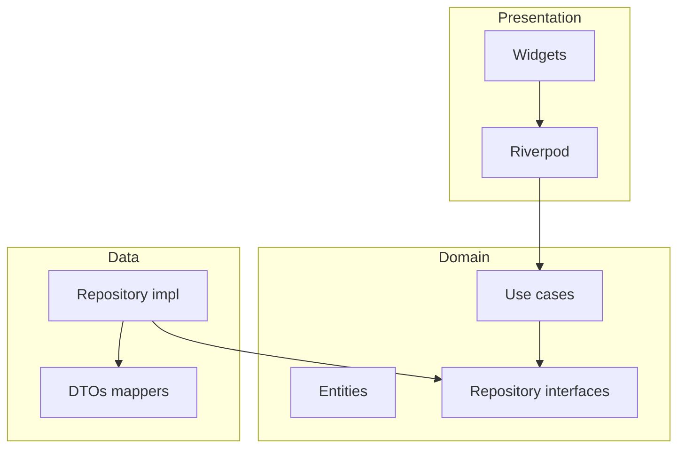

# Arquitectura

**Mink — Gimnasio cognitivo** es una app móvil de aprendizaje tipo Duolingo que ofrece **pruebas gamificadas** para entrenar capacidades cognitivas (memoria, atención, etc.) con sesiones breves y progresión estructurada.

## Resumen

- **Enfoque**: Clean Architecture con carpetas por **feature** bajo `lib/features/<feature>/`.
- **Capas por feature**: `domain`, `data`, `presentation`.
- **Estado / DI en UI**: Riverpod en `presentation`.
- **Compartido**: `lib/core/` (utilidades transversales, sin reglas de negocio de un solo feature).

## Diagrama

<!-- RELLENAR: enlaza un diagrama o pega Mermaid -->

## Estructura de carpetas (`lib/`)

<!-- RELLENAR: lista de features actuales y responsabilidad de cada uno -->

| Feature | Responsabilidad |
|---------|-----------------|
| `auth` | Login (email/contraseña), puerta de sesión (`AuthGate`). |
| `home` | Pantalla principal de ejemplo tras sesión. |

## Backend y datos (Supabase)

- **BaaS**: [Supabase](https://supabase.com/) (Postgres + Auth + PostgREST).
- **Cliente Flutter**: `supabase_flutter`; variables en `assets/env/.env` y/o `--dart-define` ([docs/SUPABASE.md](../SUPABASE.md)).
- **ORM tipo Prisma/Drizzle**: solo en servicios **Node** si se añade backend; no en la app — [ADR 0001](adr/0001-supabase-cliente-sin-orm-prisma-drizzle.md).

## Navegación y rutas

<!-- RELLENAR: paquete de rutas (go_router, auto_route, etc.) o navegación imperativa; mapa de pantallas -->

Actualmente: `MaterialApp` con `home: AuthGate` — sesión en [`auth_gate.dart`](../lib/features/auth/presentation/auth_gate.dart) (login vs. home).

## Dependencias entre módulos

<!-- RELLENAR: si hay paquetes internos o boundaries entre features -->

## Seguridad y configuración

- Supabase: solo **anon key** en cliente; sesión nativa en almacenamiento seguro; PKCE. Detalle en [docs/SUPABASE.md](../SUPABASE.md).
- Secretos de CI: preferir `--dart-define-from-file` (archivo no versionado).
