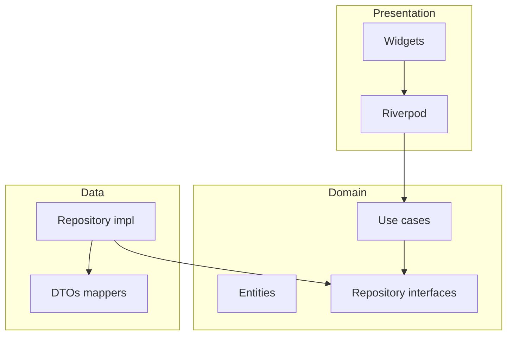

# Arquitectura

**Mink — Gimnasio cognitivo** es una app móvil de aprendizaje tipo Duolingo que ofrece **pruebas gamificadas** para entrenar capacidades cognitivas (memoria, atención, etc.) con sesiones breves y progresión estructurada.

## Resumen

- **Enfoque**: Clean Architecture con carpetas por **feature** bajo `lib/features/<feature>/`.
- **Capas por feature**: `domain`, `data`, `presentation`.
- **Estado / DI en UI**: Riverpod en `presentation`.
- **Compartido**: `lib/core/` (utilidades transversales, sin reglas de negocio de un solo feature).

## Diagrama

<!-- RELLENAR: enlaza un diagrama o pega Mermaid -->

## Estructura de carpetas (`lib/`)

<!-- RELLENAR: lista de features actuales y responsabilidad de cada uno -->

| Feature | Responsabilidad |
|---------|-----------------|
| `home` | <!-- RELLENAR --> Pantalla inicial de ejemplo. |

## Navegación y rutas

<!-- RELLENAR: paquete de rutas (go_router, auto_route, etc.) o navegación imperativa; mapa de pantallas -->

## Dependencias entre módulos

<!-- RELLENAR: si hay paquetes internos o boundaries entre features -->

## Seguridad y configuración

<!-- RELLENAR: almacenamiento de secretos, entornos (dev/staging/prod), deep links -->
